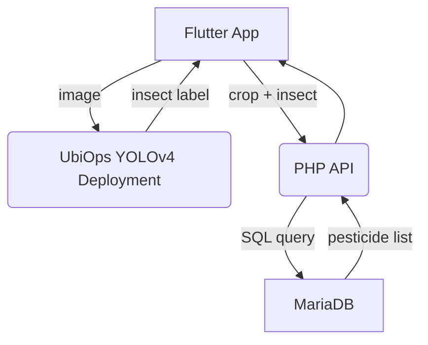

# Identification of Insects & Pesticide Recommendation using Deep Learning

> End-to-end system that identifies crop-damaging insects from a photo and instantly recommends crop-safe pesticides—powered by **YOLOv4**, **UbiOps**, **Flutter**, **PHP** & **MariaDB**.

---

## Table of Contents
1. [Project Overview](#project-overview)
2. [Core Features](#core-features)
3. [Tech Stack](#tech-stack)
4. [Prerequisites](#prerequisites)
5. [Model Training & Export](#model-training--export)
6. [Deploying on UbiOps](#deploying-on-ubiops)
7. [Backend API (PHP)](#backend-api-php)
8. [Usage Workflow](#usage-workflow)
9. [Project Structure](#project-structure)

---

## Project Overview
Conventional farming relies heavily on farmers and vendors to identify pests and pick compatible pesticides—a process prone to error and crop damage. This project automates the workflow:

1. **Detect** the insect species in an image using a custom-trained YOLOv4 model.
2. **Lookup** a relational database to retrieve pesticide options that (a) kill the detected insect and (b) are safe for the selected crop.
3. **Deliver** results to a cross-platform Flutter app within seconds, regardless of the device’s computing power.

The pipeline is completely server-driven: heavy inference runs on **UbiOps**, while crop-pesticide matching is handled by lightweight **PHP** APIs connected to a **MariaDB** instance hosted on 000webhost.

## Core Features
- **Fast, on-device capture:** Pick or snap an insect photo in the mobile app.
- **Real-time detection:** YOLOv4 detects multiple insect classes (<200 ms on GPU).
- **Expert pesticide database:** 5-table relational schema encodes crop compatibility & application guidelines.
- **API-first design:** Clean separation between CV model, database services and mobile UI.
- **Scalable deployment:** Swap in improved weights or extend the DB without changing the client.

## Tech Stack
| Layer | Technology |
|-------|------------|
| **Model Training** | Darknet YOLOv4, TensorFlow 2 (checkpoint conversion) |
| **Serving** | UbiOps serverless GPU deployments |
| **Mobile** | Flutter 3 (Android / iOS) |
| **Backend API** | PHP 8, REST (JSON + multipart) |
| **Database** | MariaDB 10.x on 000webhost |

## Prerequisites
- CUDA-capable GPU (for local training)
- Python 3.8 + pip
- Flutter 3.22 SDK
- PHP >= 8.0 & Composer (for API dev)
- MariaDB 10.x or MySQL 8.x

## Model Training & Export
1. **Image collection** — download ~2 000 images per insect class with `simple_image_download`.
2. **Annotation** — label bounding boxes in *YOLO* format using `labelImg`.
3. **Darknet training**
   ```bash
   darknet detector train data/obj.data cfg/yolov4-custom.cfg yolov4.conv.137
   ```
4. **Convert to TensorFlow checkpoint** for UbiOps:
   ```bash
   python save_model.py        --weights ./backup/yolov4-obj_best.weights        --output ./checkpoints/yolov4-416        --input_size 416 --model yolov4
   ```

## Deploying on UbiOps
1. Zip the `model_package/` directory (must contain `model.py`, `checkpoints/`, `requirements.txt`, `ubiops.yaml`).
2. Create a *Model* in the UbiOps UI → upload zip → choose **Python 3.7**.
3. Define **input** field `image_input` *(file)* and **output** field `image_output` *(file)*.
4. Generate an API **token** with `deployment-admin` & `blob-admin` roles.
5. Test with *Create Direct Request* → inspect result blob.

## Backend API (PHP)
| Endpoint | Method | Body / Params | Description |
|----------|--------|---------------|-------------|
| `/getAllCrops.php` | `GET` | – | List available crops |
| `/getAllInsects.php` | `GET` | – | List supported insects |
| `/getPesticides.php` | `POST` | `crop`, `insect` | Return pesticides that kill *insect* & are compatible with *crop* |

## Usage Workflow
1. **Launch** the app → tap *Identify Insect*.
2. **Select** or capture a photo → image uploads to UbiOps.
3. **Wait** (≈30 s) while detection runs → name with bounding box returns.
4. **Choose** crop from dropdown → app queries PHP API.
5. **Review** curated pesticide list → tap any item to open purchase link.



## Project Structure
```
root
├── training/              # Notebook
├── api/                   # PHP REST endpoints
├── db/                    # sql schema & data
├── mobile_app/            # Flutter source code
└── docs/                  # Report & PPT
```
